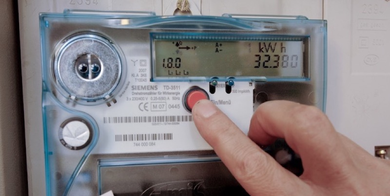

# Siemens TD-3511 Reader

Reading the energy consumption from the TD-3511 over infrared.

This is using InfluxDB 1.7.

Deploy to Raspberry Pi with: `./deploy.sh 192.168.3.58`

## Channels
My energy provider is SWL Lenzburg.

* 1.8.0 is usually total energy consumption
* 1.8.1 is usually day/weekday energy consumption
* 1.8.2 is usually night/weekend energy consumption

## Material and Links
* [Siemens TD-3511 volkszaehler.org](https://wiki.volkszaehler.org/hardware/channels/meters/power/edl-ehz/siemens_td3511)
* [InfluxDB 1 client](https://github.com/influxdata/influxdb1-client/blob/master/v2/example_test.go)
* [IR Schreib/Lesekopf USB (Optokopf)](https://shop.weidmann-elektronik.de/index.php?page=product&info=24)
